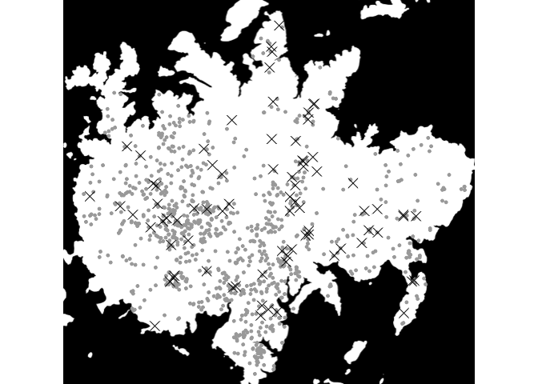
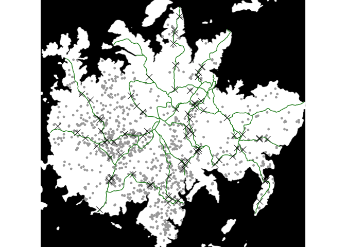
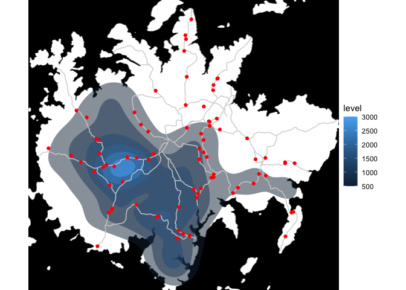
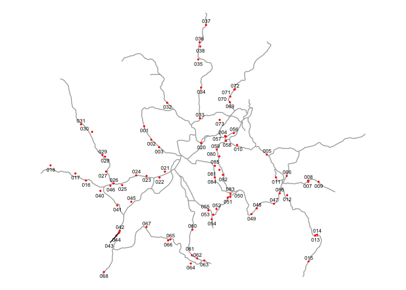
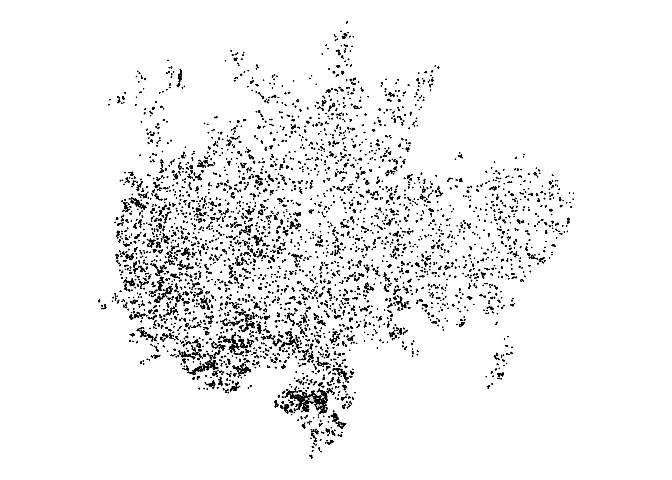
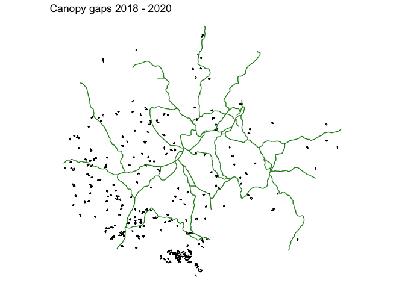
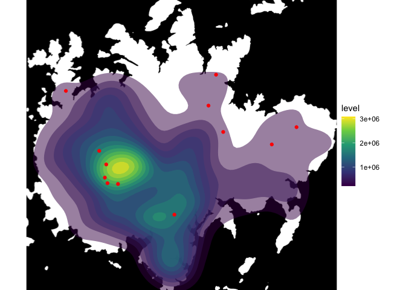

Make a map of focal trees
================
Eleanor Jackson
23 February, 2023

``` r
library("tidyverse")
library("sf")
library("ggmap")
library("osmdata")
library("plotKML")
```

## Read in gpx files

``` r
plotKML::readGPX(here::here("data", "maps", "focal_jacc.gpx")) %>%
  map_df( ~ .) %>%
  rename(id = name) %>%
  arrange(id) -> focal_jacc

plotKML::readGPX(here::here("data", "maps",
                            "jacc-map-garzonlopez2012", "jac1co_map.gpx")) %>%
  map_df( ~ .) %>%
  select(lon, lat) -> carol_jacc
```

## Make a Jacaranda map

``` r
bbox <- make_bbox(c(min(focal_jacc$lon) - 0.001, max(focal_jacc$lon) + 0.005), 
                  c(min(focal_jacc$lat) - 0.005, max(focal_jacc$lat) + 0.001))

bci_basemap <- ggmap::get_map(bbox, source = "stamen", 
                       force = TRUE, maptype = "toner-background")
bci_basemap %>% 
  ggmap() +
  geom_point(data = carol_jacc,
             colour = "darkgray",
             size = 1,
           aes(lon, lat)) +
  geom_point(data = focal_jacc,
             colour = "black",
             shape = 4,
             size = 4,
           aes(lon, lat)) +
  theme_void()
```

<!-- -->

## Add trails

``` r
# get trails from open street maps
osmdata::opq(bbox = bbox) %>%
  add_osm_feature(key = "highway") %>%
  osmdata_sf() -> osm_trails


bci_basemap %>%
  ggmap() +
  geom_point(data = carol_jacc,
             aes(lon, lat),
             colour = "darkgray",
             size = 1) +
  geom_sf(data = osm_trails$osm_lines,
          inherit.aes = FALSE,
          colour = "forestgreen") +
  geom_point(
    data = focal_jacc,
    aes(lon, lat),
    colour = "black",
    shape = 4,
    size = 4
  ) +
  theme_void()
```

    ## Coordinate system already present. Adding new coordinate system, which will
    ## replace the existing one.

<!-- -->

## plot as a density map

``` r
bci_basemap %>% 
  ggmap() +
  stat_density2d(data = carol_jacc,
                 aes(lon, lat, fill = ..level..), 
                 alpha = 0.5, geom = "polygon") + 
  geom_sf(data = osm_trails$osm_lines,
          inherit.aes = FALSE, colour = "lightgrey") +
  geom_point(data = focal_jacc,
             colour = "red",
           aes(lon, lat)) +
  theme_void()
```

    ## Coordinate system already present. Adding new coordinate system, which will
    ## replace the existing one.

<!-- -->

## A map with labels

``` r
focal_jacc %>%
  mutate(id = gsub("EJJACC", "", focal_jacc$id)) -> focal_jacc_labs

ggplot() +
  geom_sf(data = osm_trails$osm_lines,
          inherit.aes = FALSE,
          colour = "darkgrey") +
  geom_point(data = focal_jacc_labs,
             colour = "red", size = 0.5, 
           aes(lon, lat)) +
  ggrepel::geom_text_repel(data = focal_jacc_labs, 
                           aes(lon, lat, label = id), box.padding = 0.1,
                           colour = "black", hjust = -0.1, size = 2.25) +
  theme_void()
```

<!-- -->

## Take a look at canopy gap map

``` r
gaps <- sf::st_read(here::here("data", "maps",
                               "light-gaps-cushman2022", "gaps18to20sp.shp")) 
```

    ## Reading layer `gaps18to20sp' from data source 
    ##   `/Users/eleanorjackson/Library/CloudStorage/OneDrive-UniversityofReading/bci-jacc/data/maps/light-gaps-cushman2022/gaps18to20sp.shp' 
    ##   using driver `ESRI Shapefile'
    ## Simple feature collection with 5176 features and 7 fields
    ## Geometry type: POLYGON
    ## Dimension:     XY
    ## Bounding box:  xmin: 624105 ymin: 1009750 xmax: 629692 ymax: 1014878
    ## CRS:           unknown

``` r
ggplot() +
  geom_sf(data = gaps, color = "black") +
  theme_void()
```

<!-- -->

There are a *lot* of light gaps - let’s try filtering them by `area` so
we get just the biggest ones. Maybe useful if we can overlay with trails
so we can see which trails have gaps on them.

It seems that the canopy gap map doesn’t have a coordinate reference
system so I can’t overlay them on the base map or with the *Jacaranda*
density.

``` r
ggplot() +
  geom_sf(data = filter(gaps, area > 400), size = 1, color = "black") +
  geom_sf(data = osm_trails$osm_lines,
          inherit.aes = FALSE, colour = "forestgreen") +
  theme_void() +
  ggtitle("Canopy gaps 2018 - 2020")
```

<!-- -->

## Exclusion experiment sites

``` r
plotKML::readGPX(here::here("data", "maps",
                            "Exclusion_sites_JACC.gpx")) %>%
  map_df( ~ .) %>%
  rename(id = name) %>%
  arrange(id) -> exclusion_sites

bci_basemap %>% 
  ggmap() +
  stat_density2d(data = carol_jacc,
                 aes(lon, lat, fill = ..level..), 
                 alpha = 0.5, geom = "polygon", contour_var = "count", bins = 15) + 
  geom_point(data = exclusion_sites,
             colour = "red",
           aes(lon, lat)) +
  scale_fill_viridis_c() +
  theme_void()
```

<!-- -->
