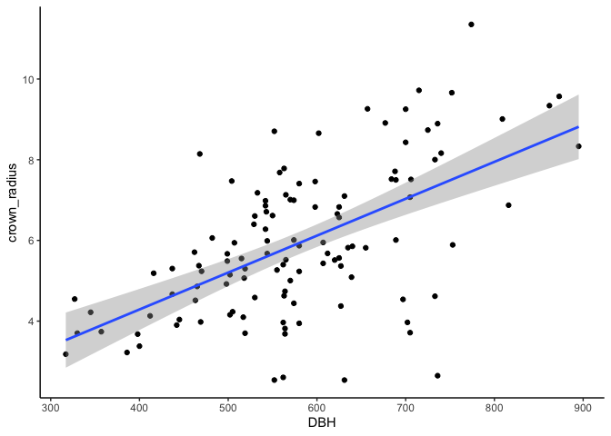
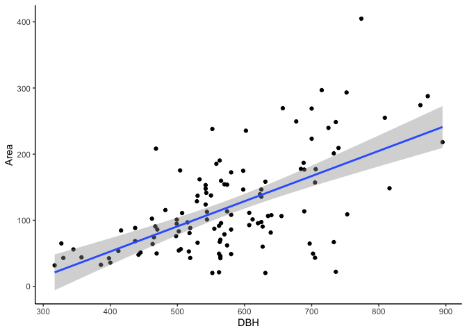

Estimate crown size of Jacaranda based on DBH
================
Eleanor Jackson
16 February, 2023

For *Jacaranda* individuals where we cannot see the canopy it would be
useful to have an estimate of crown radius. If there is a strong
relationship between DBH and crown radius we should be able to calculate
an estimate of the crown radius in the field and use this to inform the
length of our transects.

We have access to *Jacaranda copaia* allometry data from Helene
collected on BCI that we can use to quantify the relationship between
DBH and crown size.

``` r
library("tidyverse")
library("sf")
```

``` r
sf::st_read(here::here("data", "maps", "crown-map-mullerlandau",
                       "2019Crowns_AfterSwatWorksMerged.shp")) -> crown_map
```

    ## Reading layer `2019Crowns_AfterSwatWorksMerged' from data source 
    ##   `/Users/eleanorjackson/Library/CloudStorage/OneDrive-UniversityofReading/bci-jacc/data/maps/crown-map-mullerlandau/2019Crowns_AfterSwatWorksMerged.shp' 
    ##   using driver `ESRI Shapefile'
    ## Simple feature collection with 2744 features and 21 fields
    ## Geometry type: MULTIPOLYGON
    ## Dimension:     XY
    ## Bounding box:  xmin: -8889455 ymin: 1023032 xmax: -8888413 ymax: 1023581
    ## Projected CRS: WGS 84 / Pseudo-Mercator

Calculate radius from crown area:

``` r
crown_map %>%
  filter(Mnemonc == "jac1co") %>%
  mutate(crown_radius = sqrt(Area / pi),
         DBH = as.numeric(DBH)) -> crown_map_jacc
```

Fit a simple linear model:

``` r
fit <- lm(crown_map_jacc$crown_radius ~ crown_map_jacc$DBH)

summary(fit)
```

    ## 
    ## Call:
    ## lm(formula = crown_map_jacc$crown_radius ~ crown_map_jacc$DBH)
    ## 
    ## Residuals:
    ##     Min      1Q  Median      3Q     Max 
    ## -4.7136 -0.8520  0.0463  0.9369  3.6434 
    ## 
    ## Coefficients:
    ##                    Estimate Std. Error t value Pr(>|t|)    
    ## (Intercept)        0.630460   0.710128   0.888    0.377    
    ## crown_map_jacc$DBH 0.009146   0.001201   7.614 8.41e-12 ***
    ## ---
    ## Signif. codes:  0 '***' 0.001 '**' 0.01 '*' 0.05 '.' 0.1 ' ' 1
    ## 
    ## Residual standard error: 1.503 on 114 degrees of freedom
    ## Multiple R-squared:  0.3371, Adjusted R-squared:  0.3313 
    ## F-statistic: 57.97 on 1 and 114 DF,  p-value: 8.412e-12

There is a significant relationship, and looking at the `summary()`
output our equation is:

crown radius = 0.63 + (0.009 \* DBH)

We can sanity check this by plotting the data and `lm` fit.

``` r
crown_map_jacc %>%
  ggplot(aes(DBH, crown_radius)) +
  geom_point() +
  geom_smooth(method = 'lm') +
  theme_classic()
```

    ## `geom_smooth()` using formula = 'y ~ x'

<!-- -->

So pretending we’ve just measured a tree with a DBH of 400,

0.63 + (0.009 \* 400) = 4.23.

That matches up with the figure!

Ok, what about the relationship between crown area and DBH?

``` r
fit_a <- lm(crown_map_jacc$Area ~ crown_map_jacc$DBH)

summary(fit_a)
```

    ## 
    ## Call:
    ## lm(formula = crown_map_jacc$Area ~ crown_map_jacc$DBH)
    ## 
    ## Residuals:
    ##      Min       1Q   Median       3Q      Max 
    ## -158.495  -36.594   -1.189   32.195  209.911 
    ## 
    ## Coefficients:
    ##                     Estimate Std. Error t value Pr(>|t|)    
    ## (Intercept)        -99.42161   28.12635  -3.535 0.000591 ***
    ## crown_map_jacc$DBH   0.38036    0.04758   7.995 1.18e-12 ***
    ## ---
    ## Signif. codes:  0 '***' 0.001 '**' 0.01 '*' 0.05 '.' 0.1 ' ' 1
    ## 
    ## Residual standard error: 59.52 on 114 degrees of freedom
    ## Multiple R-squared:  0.3592, Adjusted R-squared:  0.3536 
    ## F-statistic: 63.91 on 1 and 114 DF,  p-value: 1.175e-12

That should be: crown area = -99.42 + (0.38 \* DBH)

``` r
crown_map_jacc %>%
  ggplot(aes(DBH, Area)) +
  geom_point() +
  geom_smooth(method = 'lm') +
  theme_classic()
```

    ## `geom_smooth()` using formula = 'y ~ x'

<!-- -->

Looks good!
