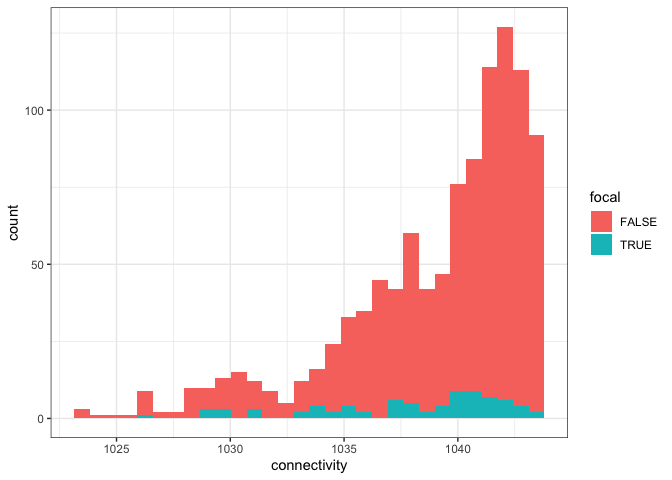
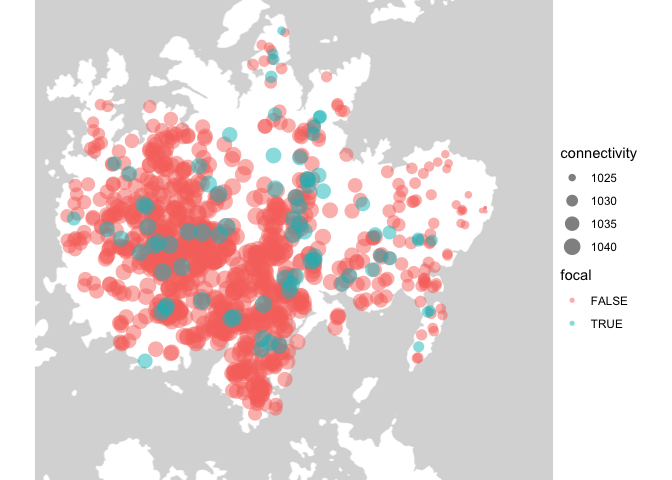

Explore conspecific densities for focal trees
================
Eleanor Jackson
28 October, 2022

We have found \~80 *Jacaranda copaia* individuals across the island, but
have we got a good range of conspecific densities in there? Do we need
to find more trees to fill in any gaps?

We could use Carol’s *Jacaranda* maps to look at natural densities of
the population and overlay with the densities of our chosen individuals.

``` r
library("tidyverse"); theme_set(theme_bw())
```

    ## ── Attaching packages ─────────────────────────────────────── tidyverse 1.3.1 ──

    ## ✓ ggplot2 3.3.5      ✓ purrr   0.3.4 
    ## ✓ tibble  3.1.6      ✓ dplyr   1.0.10
    ## ✓ tidyr   1.2.0      ✓ stringr 1.4.0 
    ## ✓ readr   2.0.2      ✓ forcats 0.5.1

    ## ── Conflicts ────────────────────────────────────────── tidyverse_conflicts() ──
    ## x dplyr::filter() masks stats::filter()
    ## x dplyr::lag()    masks stats::lag()

``` r
library("here")
```

    ## here() starts at /Users/eleanorjackson/OneDrive - University of Reading/bci-jacc

``` r
library("sf")
```

    ## Linking to GEOS 3.8.1, GDAL 3.2.1, PROJ 7.2.1

``` r
library("ggmap")
```

    ## Google's Terms of Service: https://cloud.google.com/maps-platform/terms/.

    ## Please cite ggmap if you use it! See citation("ggmap") for details.

## Read in gpx files

``` r
plotKML::readGPX(here::here("data", "maps", "focal_jacc.gpx")) %>%
  map_df( ~ .) %>%
  rename(id = name) %>%
  arrange(id) %>%
  select(id, lon, lat) -> focal_jacc
```

    ## Registered S3 methods overwritten by 'stars':
    ##   method             from
    ##   st_bbox.SpatRaster sf  
    ##   st_crs.SpatRaster  sf

``` r
plotKML::readGPX(here::here("data", "maps",
                            "jacc-map-garzonlopez2012", "jac1co_map.gpx")) %>%
  map_df( ~ .) %>%
  select(lon, lat) %>%
  mutate(id = paste0("CGL", 1:n())) -> carol_jacc

rbind(carol_jacc, focal_jacc) -> all_jacc
```

To calculate connectivity you need an estimate of ‘patch size’ - I’ve
just realised that we don’t have this for Carol’s mapped trees and we
haven’t finished collecting dbh for our focal trees yet. Will have to
use some kind of simpler metric.

Looking in [Moilanen & Nieminen
2002](https://doi.org/10.1890/0012-9658(2002)083%5B1131:SCMISE%5D2.0.CO;2),
the simplest connectivity measure is isolation (equation 1a), where
isolation of the focal tree is equal to the distance from it’s nearest
neighbour. I don’t think this will work for us as we want to look on a
bigger scale and take into account all trees across the island. We could
calculate Hanski’s connectivity without alpha so that the buffer radius
= infinity and also remove `A` (patch size).

Hanski’s connectivity:

*S*<sub>*i*</sub> = ∑*e**x**p*( − *α**d**i**s**t*<sub>*j**i*</sub>)*A*<sub>*j*</sub>

Simplified connectivity:

*S*<sub>*i*</sub> = ∑*e**x**p*( − *d**i**s**t*<sub>*j**i*</sub>)

## Calculate a simplified connectivity metric for all mapped *Jacaranda* on BCI

First get distances between all trees.

``` r
calculate_dist <- function (data) {

    data %>%
    select(lat, lon) -> plot_matrix

    rdist::pdist(plot_matrix[,c("lat", "lon")], 
                 metric = "euclidean") -> dists
    
    as.data.frame(dists) -> dists_df

    unlist(data$id) -> colnames(dists_df) 

    cbind(data, dists_df)
    
}

distance_df <- calculate_dist(all_jacc)
```

Then calculate the connectivity metric for each tree:

``` r
all_jacc %>% 
  distinct(id) %>%
  pull(id) -> tree_id_list

calculate_connectivity <- function (data, tree_id) {
  data %>%
    group_by(id) %>%
    mutate(x = exp(- eval(parse(text = tree_id)) ) ) %>%
    ungroup() %>%
    summarise(id = paste(tree_id),
              connectivity = sum(x), .groups = "drop")
}

connectivity_dfs <- lapply(tree_id_list,
                           calculate_connectivity, data = distance_df)

connectivity_dfs %>%
  lapply(drop_na, connectivity) %>%
  dplyr::bind_rows() -> all_connectivity_dfs
```

## Plot

To see if we’ve covered a good range of the natural densities I’m just
going to plot the connectivity values as a histogram.

``` r
all_connectivity_dfs %>%
  mutate(focal = grepl("EJJACC", id)) -> plot_dat

plot_dat %>%
  ggplot() +
  geom_histogram(aes(x = connectivity, fill = focal))
```

    ## `stat_bin()` using `bins = 30`. Pick better value with `binwidth`.

<!-- -->

Looks like we could do with some more trees at the lowest levels of
connectivity and perhaps some at the very highest. Where can we find
those individuals? Lets plot on a map.

``` r
bbox <- make_bbox(c(min(all_jacc$lon) - 0.001, max(all_jacc$lon) + 0.005), 
                  c(min(all_jacc$lat) - 0.005, max(all_jacc$lat) + 0.001))

bci_basemap <- ggmap::get_map(bbox, source = "stamen", 
                       force = TRUE, maptype = "toner-lite")
```

    ## Map tiles by Stamen Design, under CC BY 3.0. Data by OpenStreetMap, under ODbL.

``` r
plot_data <- left_join(all_jacc, plot_dat, by = "id")

bci_basemap %>% 
  ggmap() +
  geom_point(data = plot_data, 
             aes(x = lon, y = lat, size = connectivity, colour = focal),
             alpha = 0.5, shape =  16) +
  theme_void()
```

<!-- -->

We need to look on the eastern side of the island for low connectivity
trees and perhaps pick up a few in/around the 50 ha plot for high
connectivity individuals.
