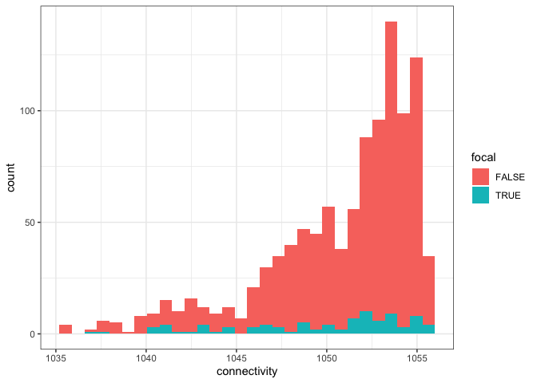
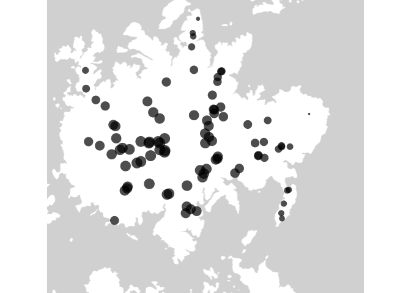

Explore conspecific densities for focal trees (again)
================
Eleanor Jackson
21 November, 2022

Ok, since we’ve now sampled 90 trees and added a few at v high and v low
conspecific densities let’s look again at the distribution of
connectivity for our focal trees.

``` r
library("tidyverse"); theme_set(theme_bw())
```

    ## ── Attaching packages ─────────────────────────────────────── tidyverse 1.3.1 ──

    ## ✓ ggplot2 3.3.5      ✓ purrr   0.3.4 
    ## ✓ tibble  3.1.6      ✓ dplyr   1.0.10
    ## ✓ tidyr   1.2.0      ✓ stringr 1.4.0 
    ## ✓ readr   2.0.2      ✓ forcats 0.5.1

    ## ── Conflicts ────────────────────────────────────────── tidyverse_conflicts() ──
    ## x dplyr::filter() masks stats::filter()
    ## x dplyr::lag()    masks stats::lag()

``` r
library("here")
```

    ## here() starts at /Users/eleanorjackson/OneDrive - University of Reading/bci-jacc

``` r
library("sf")
```

    ## Linking to GEOS 3.8.1, GDAL 3.2.1, PROJ 7.2.1

``` r
library("ggmap")
```

    ## Google's Terms of Service: https://cloud.google.com/maps-platform/terms/.

    ## Please cite ggmap if you use it! See citation("ggmap") for details.

## Read in gpx files

``` r
plotKML::readGPX(here::here("data", "raw", "Final_JACC_sites.gpx")) %>%
  map_df( ~ .) %>%
  rename(id = name) %>%
  arrange(id) %>%
  select(id, lon, lat) %>%
  filter(!grepl("NS", id)) -> focal_jacc
```

    ## Registered S3 methods overwritten by 'stars':
    ##   method             from
    ##   st_bbox.SpatRaster sf  
    ##   st_crs.SpatRaster  sf

``` r
plotKML::readGPX(here::here("data", "maps",
                            "jacc-map-garzonlopez2012", "jac1co_map.gpx")) %>%
  map_df( ~ .) %>%
  select(lon, lat) %>%
  mutate(id = paste0("CGL", 1:n())) -> carol_jacc

rbind(carol_jacc, focal_jacc) -> all_jacc
```

## Calculate a simplified connectivity metric for all mapped *Jacaranda* on BCI

First get distances between all trees.

``` r
calculate_dist <- function (data) {

    data %>%
    select(lat, lon) -> plot_matrix

    rdist::pdist(plot_matrix[,c("lat", "lon")], 
                 metric = "euclidean") -> dists
    
    as.data.frame(dists) -> dists_df

    unlist(data$id) -> colnames(dists_df) 

    cbind(data, dists_df)
    
}

distance_df <- calculate_dist(all_jacc)
```

Then calculate the connectivity metric for each tree:

``` r
all_jacc %>% 
  distinct(id) %>%
  pull(id) -> tree_id_list

calculate_connectivity <- function (data, tree_id) {
  data %>%
    group_by(id) %>%
    mutate(x = exp(- eval(parse(text = tree_id)) ) ) %>%
    ungroup() %>%
    summarise(id = paste(tree_id),
              connectivity = sum(x), .groups = "drop")
}

connectivity_dfs <- lapply(tree_id_list,
                           calculate_connectivity, data = distance_df)

connectivity_dfs %>%
  lapply(drop_na, connectivity) %>%
  dplyr::bind_rows() -> all_connectivity_dfs
```

## Plot

``` r
all_connectivity_dfs %>%
  mutate(focal = grepl("EJJACC", id)) -> plot_dat

plot_dat %>%
  ggplot() +
  geom_histogram(aes(x = connectivity, fill = focal))
```

    ## `stat_bin()` using `bins = 30`. Pick better value with `binwidth`.

<!-- -->
To compare, here is the histogram we plotted pre pod data collection:


It’s not looking as good as we’d hoped. There is better covereage of the
lower connectivities but still only a couple of trees sitting at the low
end. There’s a danger that we could end up with poor confidence in any
regressions.

``` r
bbox <- make_bbox(c(min(all_jacc$lon) - 0.001, max(all_jacc$lon) + 0.005), 
                  c(min(all_jacc$lat) - 0.005, max(all_jacc$lat) + 0.001))

bci_basemap <- ggmap::get_map(bbox, source = "stamen", 
                       force = TRUE, maptype = "toner-lite")
```

    ## Map tiles by Stamen Design, under CC BY 3.0. Data by OpenStreetMap, under ODbL.

``` r
plot_data <- left_join(all_jacc, plot_dat, by = "id")

bci_basemap %>% 
  ggmap() +
  geom_point(data = filter(plot_data, focal == TRUE), 
             aes(x = lon, y = lat, size = connectivity),
             alpha = 0.7, shape =  16) +
  theme_void() +
  theme(legend.position = "none")
```

<!-- -->

Some of the individuals we picked up on Gross aren’t looking as good as
we’d hoped and we really struggled to find to find that low density
point on T.Barbour but it looks like it’s the lowest density one that
we’ve got. Could be worth trying Miller again or North of T.Barbour.
