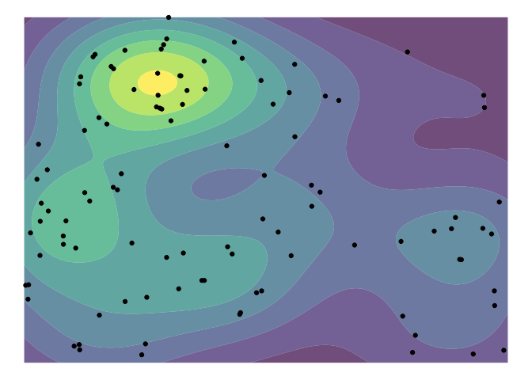
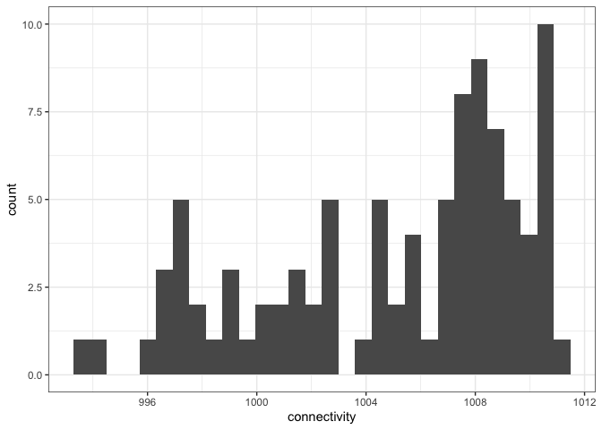
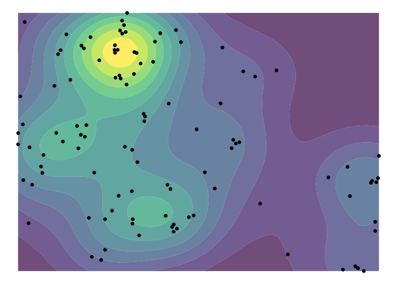
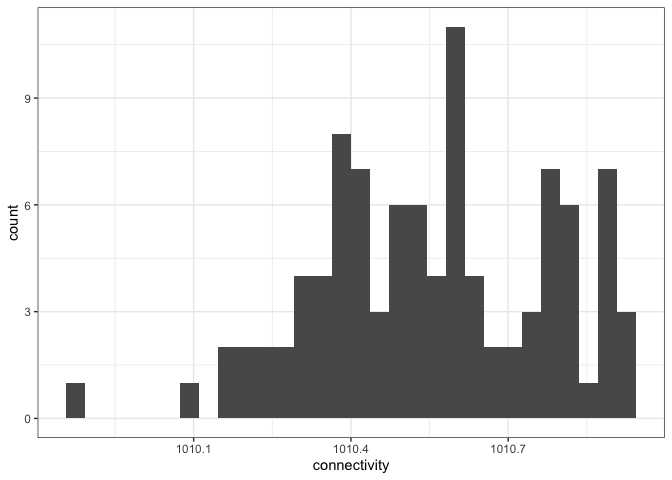

Create preliminary figures for BES poster
================
Eleanor Jackson
05 December, 2022

``` r
library("tidyverse"); theme_set(theme_bw())
```

    ## ── Attaching packages ─────────────────────────────────────── tidyverse 1.3.1 ──

    ## ✓ ggplot2 3.3.5      ✓ purrr   0.3.4 
    ## ✓ tibble  3.1.6      ✓ dplyr   1.0.10
    ## ✓ tidyr   1.2.0      ✓ stringr 1.4.0 
    ## ✓ readr   2.0.2      ✓ forcats 0.5.1

    ## ── Conflicts ────────────────────────────────────────── tidyverse_conflicts() ──
    ## x dplyr::filter() masks stats::filter()
    ## x dplyr::lag()    masks stats::lag()

``` r
library("here")
```

    ## here() starts at /Users/eleanorjackson/OneDrive - University of Reading/bci-jacc

``` r
library("sf")
```

    ## Linking to GEOS 3.8.1, GDAL 3.2.1, PROJ 7.2.1

``` r
library("ggmap")
```

    ## Google's Terms of Service: https://cloud.google.com/maps-platform/terms/.

    ## Please cite ggmap if you use it! See citation("ggmap") for details.

``` r
library("patchwork")
library("ggtext")
library("geosphere")
```

## Map of conspecific density across BCI

``` r
plotKML::readGPX(here::here("data", "maps",
                            "jacc-map-garzonlopez2012", "jac1co_map.gpx")) %>%
  map_df( ~ .) %>%
  select(lon, lat) %>%
  mutate(id = paste0("CGL", 1:n())) -> carol_jacc
```

    ## Registered S3 methods overwritten by 'stars':
    ##   method             from
    ##   st_bbox.SpatRaster sf  
    ##   st_crs.SpatRaster  sf

``` r
read_sf(here::here("data", "maps", "BCI_Plot_50ha", 
                                "BCI_Plot_50ha.shp")) %>%
  st_transform(plot_50ha, crs = st_crs(4326)) -> plot_50ha
```

``` r
bbox <- make_bbox(c(min(carol_jacc$lon) - 0.001, max(carol_jacc$lon) + 0.005), 
                  c(min(carol_jacc$lat) - 0.005, max(carol_jacc$lat) + 0.001))

bci_basemap <- ggmap::get_map(bbox, source = "stamen", 
                       force = TRUE, maptype = "toner-lite")
```

``` r
bci_basemap %>% 
  ggmap() +
  stat_density2d_filled(data = carol_jacc,
                 aes(lon, lat, fill = ..level..), 
                 alpha = 0.9, show.legend = FALSE, 
                 contour_var = "count", bins = 20) +
  geom_sf(data = plot_50ha, inherit.aes = FALSE, fill = NA, colour = "red") +
  theme_void() -> p_map
```

    ## Coordinate system already present. Adding new coordinate system, which will replace the existing one.

``` r
ggsave(here::here("code", "exploration", "figures", 
                  "2022-11-22_create-poster-figures", 
                  "density_map2.png"), plot = p_map,
    device = "png", dpi = 600, width = 120, height = 80, units = "mm")
```

### Map of conspecific density in the 50ha plot

``` r
readRDS("/Users/eleanorjackson/OneDrive - University of Reading/spatial-premature-fruit-drop/data/clean/tree_data.rds") %>%
  filter(sp4 == "jacc" & year == 2017) %>%
  rename(lon = x, lat = y) -> ha50_trees

ggplot() +
  stat_density2d_filled(data = ha50_trees,
                 aes(lon, lat, fill = ..level..), alpha = 0.7, 
                 geom = "polygon", show.legend = FALSE) +
  geom_point(data = ha50_trees, aes(lon, lat))+
  ylim(0, 500) +
  xlim(0, 1000) +
  theme_void()
```

<!-- -->

## Connectivity histograms

### whole BCI connectivity histogram

``` r
plotKML::readGPX(here::here("data", "raw", "Final_JACC_sites.gpx")) %>%
  map_df( ~ .) %>%
  rename(id = name) %>%
  arrange(id) %>%
  select(id, lon, lat) %>%
  filter(!grepl("NS", id)) %>% 
  add_row(id = "EJJACC155", lon = -79.837979, lat = 9.171755) %>%
  add_row(id = "EJJACC156", lon = -79.828260, lat = 9.160488) %>%
  add_row(id = "EJJACC157", lon = -79.827505, lat = 9.161556) %>%
  add_row(id = "EJJACC119", lon = -79.851366, lat = 9.152496) -> focal_jacc
```

Remove any trees in Carol’s data that could be duplicates of our focal
trees

``` r
geosphere::distm(cbind(pull(focal_jacc, lon), pull(focal_jacc, lat)), 
                 cbind(pull(carol_jacc, lon), pull(carol_jacc, lat)), 
                 fun = distGeo) -> dist_matrix

rownames(dist_matrix) <- focal_jacc$id
colnames(dist_matrix) <- carol_jacc$id

as.data.frame.table(dist_matrix, responseName = "dist") %>% 
  filter(dist <= 30) %>%
  group_by(Var1) %>%
  slice(which.min(dist)) %>% 
  ungroup() %>%
  pull(Var2) %>%
  unique() -> duplicate_trees

rbind(carol_jacc, focal_jacc) %>% 
  filter(!id %in% duplicate_trees) -> all_jacc
```

Calculate distances between all trees

``` r
calculate_dist <- function (data) {

    data %>%
    select(lat, lon) -> plot_matrix

    rdist::pdist(plot_matrix[,c("lat", "lon")], 
                 metric = "euclidean") -> dists
    
    as.data.frame(dists) -> dists_df

    unlist(data$id) -> colnames(dists_df) 

    cbind(data, dists_df)
    
}

distance_df <- calculate_dist(all_jacc)
```

Calculate connectivity of all trees

``` r
all_jacc %>% 
  distinct(id) %>%
  pull(id) -> tree_id_list

calculate_connectivity <- function (data, tree_id) {
  data %>%
    group_by(id) %>%
    mutate(x = exp(- eval(parse(text = tree_id)) ) ) %>%
    ungroup() %>%
    summarise(id = paste(tree_id),
              connectivity = sum(x), .groups = "drop")
}

connectivity_dfs <- lapply(tree_id_list,
                           calculate_connectivity, data = distance_df)

connectivity_dfs %>%
  lapply(drop_na, connectivity) %>%
  dplyr::bind_rows() -> all_connectivity_dfs
```

Plot histogram

``` r
all_connectivity_dfs %>%
  mutate(focal = grepl("EJJACC", id)) %>%
  filter(focal == TRUE) %>%
  select(id, connectivity) %>%
  mutate(study = "whole island") -> bci_focal_connect

bci_focal_connect %>%
  ggplot() +
  geom_histogram(aes(x = connectivity))
```

    ## `stat_bin()` using `bins = 30`. Pick better value with `binwidth`.

<!-- -->

### 50 ha plot connectivity histogram

``` r
# filter for trees in carol's maps that are within the 50ha
read_sf(here::here("data", "maps",
                            "jacc-map-garzonlopez2012", "JAC1COpointSept.shp")) %>%
  st_transform(crs = st_crs(4326)) %>%
  sf::st_intersection(plot_50ha) %>%
  ggplot(aes(x = X, y = Y))+
  stat_density2d_filled(aes(fill = ..level..), alpha = 0.7, 
                 geom = "polygon", show.legend = FALSE) +
  geom_point() +
  theme_void()
```

<!-- -->

Carol’s data looks similar to the 50ha plot data above - a good sign.

``` r
read_sf(here::here("data", "maps",
                            "jacc-map-garzonlopez2012", "JAC1COpointSept.shp")) %>%
  mutate(id = paste0("CGL", 1:n())) %>%
  st_transform(crs = st_crs(4326)) %>%
  sf::st_intersection(plot_50ha) %>%
  left_join(all_connectivity_dfs, by = "id") -> plot_50ha_connect

ggplot(plot_50ha_connect) +
  geom_histogram(aes(x = connectivity))
```

    ## `stat_bin()` using `bins = 30`. Pick better value with `binwidth`.

<!-- -->

### Comparison histogram

``` r
plot_50ha_connect %>%
  st_drop_geometry() %>%
  select(id, connectivity) %>%
  mutate(study = "50ha plot") %>%
  rbind(bci_focal_connect) %>%
  ggplot(aes(x = connectivity, fill = study)) +
  geom_histogram(position = "identity",
                 alpha = 0.8,
                 bins = 50) +
  scale_color_manual(values = c("#999999", "#440154FF")) +
  scale_fill_manual(values = c("#999999",  "#440154FF")) +
  theme_classic(base_size = 10) +
  scale_x_continuous(expand = c(0, 0)) +
  xlab("conspecific density") +
  ylab("") +
  labs(subtitle = "n trees") + 
  scale_y_continuous(breaks = seq(0, 60, 10)) +
  theme(
    line = element_blank(),
    axis.text.x = element_blank(),
    legend.position = "none",
    plot.subtitle = element_text(colour = "#2c365e", hjust = -0.05, vjust = -5),
    axis.text.y = element_text(colour = "#2c365e"),
    axis.title.x = element_text(colour = "#2c365e")
  ) -> p


p +
  annotate(
    geom = "curve",
    x = 1051, y = 40,
    xend = 1054, yend = 20,
    colour = "#999999",
    curvature = .3,
    arrow = arrow(length = unit(2, "mm"))
  ) +
  annotate(
    geom = "text",
    x = 1052, y = 47,
    colour = "#999999",
    label = "trees sampled in the\n 50ha plot (0.5km2)",
    hjust = "right",
    size = 4
  ) +
  
  annotate(
    geom = "curve",
    x = 1048, y = 30,
    xend = 1051, yend = 5,
    colour = "#440154FF",
    curvature = -.2,
    arrow = arrow(length = unit(2, "mm"))
  ) +
  annotate(
    geom = "text",
    x = 1047.7, y = 30,
    colour = "#440154FF",
    label = "trees sampled in our study\n across the 15.6km2 island",
    hjust = "right",
    size = 4
  ) +
  theme(plot.margin = margin(1, 1, 1, 1, "mm")) +
  coord_cartesian(ylim = c(0, 65), clip = 'off') -> p2

ggsave(here::here("code", "exploration", "figures", 
                  "2022-11-22_create-poster-figures", "01_histogram_new2.png"), plot = p2,
    device = "png", dpi = 600, width = 120, height = 80, units = "mm")
```

## sort out pod data

``` r
read.csv(here::here("data", "raw", "jacaranda_pods.csv")) %>%
  mutate(pod_size_mm = as.numeric(pod_size_mm)) %>%
  mutate(pod_size_mm = as.numeric(pod_size_mm)) %>% 
  filter(!is.na(pod_half_whole) & !is.na(pod_predated)) %>%
  mutate(pod_half_whole = recode(pod_half_whole, "half" = 0.5,
                                  "whole" = 1)) %>%
  mutate(pod_size_adjusted = coalesce(pod_size_string_mm, pod_size_mm)) %>%
  filter(!is.na(pod_size_adjusted) & morph != "missing") -> pod_data

# n aborted
pod_data %>% 
  mutate(pod_aborted = case_when(pod_size_adjusted < 40 & 
                                   morph == "symmetrical_locules" ~ TRUE,
                                 is.na(pod_size_adjusted) ~ NA,
                                 TRUE ~ FALSE)) %>%
  filter(pod_aborted == TRUE) %>%
  group_by(tree) %>% 
  summarise(n_aborted = sum(pod_half_whole, na.rm = TRUE), .groups = "drop"
            ) -> aborted_pods
  
# n predated
pod_data %>%
  filter(pod_predated == TRUE) %>%
  group_by(tree) %>% 
  summarise(n_predated = sum(pod_half_whole, na.rm = TRUE), .groups = "drop"
            ) -> predated_pods

# n healthy mature
pod_data %>% 
  mutate(pod_healthy = case_when(pod_size_adjusted >= 40 & 
                                   morph == "symmetrical_locules" ~ TRUE,
                                 is.na(pod_size_adjusted) ~ NA,
                                 TRUE ~ FALSE)) %>%
  filter(pod_healthy == TRUE) %>%
  group_by(tree) %>% 
  summarise(n_healthy = sum(pod_half_whole, na.rm = TRUE), .groups = "drop"
            ) -> healthy_pods

full_join(predated_pods, aborted_pods) %>% 
  full_join(healthy_pods) %>% 
  mutate(across(where(is.numeric), ~replace_na(.x, 0))) %>%
  mutate(across(where(is.numeric), ~ceiling(.x))) %>%
  mutate(total_pods = n_healthy + n_aborted + n_predated) -> clean_pods
```

    ## Joining, by = "tree"
    ## Joining, by = "tree"

``` r
pod_data %>%
  select(tree, dbh_mm, crown_radius_m, date) %>%
  distinct() -> tree_data

bci_focal_connect %>%
  mutate(id = gsub("EJ", "", id) ) %>%
  mutate(id = gsub("^(JACC)", "\\1_\\2", id)) %>% 
  right_join(clean_pods, by = c("id" = "tree")) %>%
  left_join(tree_data, by = c("id" = "tree")) -> pods_connect
```

## proportion pods predated \~ connectivity

``` r
glm(pods_connect, formula = cbind(n_predated, (total_pods - n_predated)) ~ connectivity,
    family = "binomial") -> m1
summary(m1)
```

    ## 
    ## Call:
    ## glm(formula = cbind(n_predated, (total_pods - n_predated)) ~ 
    ##     connectivity, family = "binomial", data = pods_connect)
    ## 
    ## Deviance Residuals: 
    ##     Min       1Q   Median       3Q      Max  
    ## -7.6132  -2.2475  -0.8830   0.6164  11.3496  
    ## 
    ## Coefficients:
    ##                Estimate Std. Error z value Pr(>|z|)    
    ## (Intercept)  -29.983617   8.596210  -3.488 0.000487 ***
    ## connectivity   0.028577   0.008556   3.340 0.000838 ***
    ## ---
    ## Signif. codes:  0 '***' 0.001 '**' 0.01 '*' 0.05 '.' 0.1 ' ' 1
    ## 
    ## (Dispersion parameter for binomial family taken to be 1)
    ## 
    ##     Null deviance: 723.37  on 90  degrees of freedom
    ## Residual deviance: 712.09  on 89  degrees of freedom
    ## AIC: 948.05
    ## 
    ## Number of Fisher Scoring iterations: 4

``` r
pods_connect %>%
  ggplot(aes(
    x = connectivity,
    y = n_predated / total_pods,
    succ = n_predated,
    fail = (total_pods - n_predated)
  )) +
  geom_point(
    colour = "#440154FF",
    alpha = 0.7,
    shape = 16) +
  geom_smooth(
    method = "glm", 
    colour = "#2c365e",
    se = TRUE,
    method.args = list(family = "binomial"),
    formula = cbind(succ, fail) ~ x
  ) +
  theme_classic(base_size = 10) +
  xlab("conspecific density") +
  ylab("") +
  scale_y_continuous(breaks = seq(0, 0.6, 0.6)) +
  theme(
    line = element_blank(),
    axis.text.x = element_blank(),
    legend.position = "none",
    axis.text.y = element_text(colour = "#2c365e"),
    axis.title.x = element_text(colour = "#2c365e"),
    plot.subtitle = element_text(colour = "#2c365e", hjust = -0.07, vjust = -6),
    plot.caption = element_markdown(colour = "#2c365e", size = 5)
  ) +
  theme(plot.margin = margin(1, 1, 1, 1, "mm")) +
  coord_cartesian(ylim = c(0, 0.65), clip = 'off') +
  labs(caption = paste("binomial glm: β = ", 
                       parse(text = round(pluck(m1$coefficients, 2), digits = 2)),
                       " [", parse(text = round(pluck(confint(m1, "connectivity"), 1), digits = 2)), ", ", 
                       parse(text = round(pluck(confint(m1, "connectivity"), 2), digits = 2)), "],",
                       " _p_ = < 0.001", sep = ""),
       subtitle = "propotion of \npredated fruits") -> p3
```

    ## Waiting for profiling to be done...
    ## Waiting for profiling to be done...

``` r
ggsave(here::here("code", "exploration", "figures", 
                  "2022-11-22_create-poster-figures", "01_glm.png"), plot = p3,
    device = "png", dpi = 600, width = 120, height = 80, units = "mm")
```

## n pods \~ connectivity

``` r
glm(formula = total_pods ~ connectivity, data = pods_connect) -> m2
summary(m2)
```

    ## 
    ## Call:
    ## glm(formula = total_pods ~ connectivity, data = pods_connect)
    ## 
    ## Deviance Residuals: 
    ##    Min      1Q  Median      3Q     Max  
    ## -44.88  -27.72  -17.13   10.94  231.68  
    ## 
    ## Coefficients:
    ##              Estimate Std. Error t value Pr(>|t|)
    ## (Intercept)  1162.352   1016.682   1.143    0.256
    ## connectivity   -1.118      1.012  -1.105    0.272
    ## 
    ## (Dispersion parameter for gaussian family taken to be 2140.862)
    ## 
    ##     Null deviance: 193151  on 90  degrees of freedom
    ## Residual deviance: 190537  on 89  degrees of freedom
    ## AIC: 960.1
    ## 
    ## Number of Fisher Scoring iterations: 2

``` r
pods_connect %>%
  ggplot(aes(
    x = connectivity,
    y = total_pods)) +
  geom_point(
    colour = "#440154FF",
    alpha = 0.7,
    shape = 16) +
  geom_smooth(
    method = "glm", 
    colour = "#2c365e",
    se = TRUE
  ) +
  theme_classic(base_size = 10) +
  xlab("conspecific density") +
  ylab("") +
  theme(
    line = element_blank(),
    axis.text.x = element_blank(),
    legend.position = "none",
    axis.text.y = element_text(colour = "#2c365e"),
    axis.title.x = element_text(colour = "#2c365e"),
    plot.subtitle = element_text(colour = "#2c365e", hjust = -0.07, vjust = -3),
    plot.caption = element_markdown(colour = "#2c365e", size = 5)
  ) +
  theme(plot.margin = margin(1, 1, 1, 1, "mm")) +
  coord_cartesian(ylim = c(0, 500), clip = 'off') +
  labs(caption = paste("gaussian glm: β = ", 
                       parse(text = round(pluck(m2$coefficients, 2), digits = 2)),
                       " [", parse(text = round(pluck(confint(m2, "connectivity"), 1), digits = 2)), ", ", 
                       parse(text = round(pluck(confint(m2, "connectivity"), 2), digits = 2)), "],",
                       " _p_ = 0.136", sep = ""),
       subtitle = "n fruits") -> p4
```

    ## Waiting for profiling to be done...
    ## Waiting for profiling to be done...

``` r
ggsave(here::here("code", "exploration", "figures", 
                  "2022-11-22_create-poster-figures", "02_glm.png"), plot = p4,
    device = "png", dpi = 600, width = 120, height = 80, units = "mm")
```

    ## `geom_smooth()` using formula 'y ~ x'

## porportion pods aborted \~ connectivity

``` r
glm(pods_connect, formula = cbind(n_aborted, (total_pods - n_aborted)) ~ connectivity,
    family = "binomial") -> m3
summary(m3)
```

    ## 
    ## Call:
    ## glm(formula = cbind(n_aborted, (total_pods - n_aborted)) ~ connectivity, 
    ##     family = "binomial", data = pods_connect)
    ## 
    ## Deviance Residuals: 
    ##     Min       1Q   Median       3Q      Max  
    ## -5.6901  -1.5795  -0.6874   0.7166  14.6039  
    ## 
    ## Coefficients:
    ##               Estimate Std. Error z value Pr(>|z|)   
    ## (Intercept)  27.166844   9.157411   2.967  0.00301 **
    ## connectivity -0.028608   0.009122  -3.136  0.00171 **
    ## ---
    ## Signif. codes:  0 '***' 0.001 '**' 0.01 '*' 0.05 '.' 0.1 ' ' 1
    ## 
    ## (Dispersion parameter for binomial family taken to be 1)
    ## 
    ##     Null deviance: 600.26  on 90  degrees of freedom
    ## Residual deviance: 590.45  on 89  degrees of freedom
    ## AIC: 824.02
    ## 
    ## Number of Fisher Scoring iterations: 4

``` r
pods_connect %>%
  ggplot(aes(
    x = connectivity,
    y = n_aborted / total_pods,
    succ = n_aborted,
    fail = (total_pods - n_aborted)
  )) +
  geom_point(
    colour = "#440154FF",
    alpha = 0.7,
    shape = 16) +
  geom_smooth(
    method = "glm", 
    colour = "#2c365e",
    se = TRUE,
    method.args = list(family = "binomial"),
    formula = cbind(succ, fail) ~ x
  ) +
  theme_classic(base_size = 10) +
  xlab("conspecific density") +
  ylab("") +
  scale_y_continuous(breaks = seq(0, 0.8, 0.8)) +
  theme(
    line = element_blank(),
    axis.text.x = element_blank(),
    legend.position = "none",
    axis.text.y = element_text(colour = "#2c365e"),
    axis.title.x = element_text(colour = "#2c365e"),
    plot.subtitle = element_text(colour = "#2c365e", hjust = -0.07, vjust = -6),
    plot.caption = element_markdown(colour = "#2c365e", size = 5)
  ) +
  theme(plot.margin = margin(1, 1, 1, 1, "mm")) +
  coord_cartesian(ylim = c(0, 0.85), clip = 'off') +
  labs(caption = paste("binomial glm: β = ", 
                       parse(text = round(pluck(m3$coefficients, 2), digits = 2)),
                       " [", parse(text = round(pluck(confint(m3, "connectivity"), 1), digits = 2)), ", ", 
                       parse(text = round(pluck(confint(m3, "connectivity"), 2), digits = 2)), "],",
                       " _p_ = < 0.001", sep = ""),
       subtitle = "propotion of \nimmature fruits") -> p5
```

    ## Waiting for profiling to be done...
    ## Waiting for profiling to be done...

``` r
ggsave(here::here("code", "exploration", "figures", 
                  "2022-11-22_create-poster-figures", "03_glm.png"), plot = p5,
    device = "png", dpi = 600, width = 120, height = 80, units = "mm")
```

## pod size \~ connectivity

``` r
pods_connect %>%
  mutate(pod_size_mm = as.numeric(pod_size_mm)) %>%
  filter(morph == "symmetrical_locules") %>% 
  glm(formula = pod_size_mm ~ connectivity,
    family = "gaussian") -> m4
summary(m4)

pods_connect %>%
  mutate(pod_size_mm = as.numeric(pod_size_mm)) %>%
  filter(morph == "symmetrical_locules") %>%
  ggplot(aes(
    x = connectivity,
    y = pod_size_mm
  )) +
  geom_jitter(size = 1, alpha = 0.25, colour = "#440154FF", 
              shape = 16, width = 0.2) +
  stat_summary(aes(group = tree), fun = median, geom = "point",
               size = 2, stroke = 0.2, shape = 21,
               fill = "#440154FF", colour = "black" ) +
  geom_smooth(
    method = "glm", 
    colour = "#2c365e",
    se = TRUE
  ) +
  theme_classic(base_size = 10) +
  xlab("conspecific density") +
  ylab("") +
  theme(
    line = element_blank(),
    axis.text.x = element_blank(),
    legend.position = "none",
    axis.text.y = element_text(colour = "#2c365e"),
    axis.title.x = element_text(colour = "#2c365e"),
    plot.subtitle = element_text(colour = "#2c365e", hjust = -0.07, vjust = -3),
    plot.caption = element_markdown(colour = "#2c365e", size = 5)
  ) +
  coord_cartesian(ylim = c(0, 150), clip = 'off') +
  labs(caption = paste("gaussian glm: β = ", 
                       parse(text = round(pluck(m4$coefficients, 2), digits = 2)),
                       " [", 
                       parse(text = round(pluck(confint(m4, "connectivity"), 1), 
                                          digits = 2)), 
                       ", ", 
                       parse(text = round(pluck(confint(m4, "connectivity"), 2), 
                                          digits = 2)),
                       "],",
                       " _p_ = < 0.001", sep = ""),
       subtitle = "fruit size (mm)") + 
  annotate(geom = "point", x = 1008.7, y = 159.5,
           colour = "black", stroke = 0.2, fill = "#440154FF", shape = 21) + 
  annotate(geom = "text", label = "- tree median", x = 1010, y = 160, 
           size = 2, colour = "#2c365e") -> p7
  
ggsave(here::here("code", "exploration", "figures", 
                  "2022-11-22_create-poster-figures", "07_glm.png"), plot = p7,
    device = "png", dpi = 600, width = 120, height = 80, units = "mm")  
```

## Map of seed traps

``` r
readRDS("/Users/eleanorjackson/OneDrive - University of Reading/spatial-premature-fruit-drop/data/clean/trap_data.rds") %>%
  filter(year == "2018") %>% 
  distinct(trap, x, y) -> trap_loc

ggplot(trap_loc, aes(x = x, y = y)) +
  geom_point(
    colour = "#440154FF",
    alpha = 0.7,
    shape = 16) +
  theme_classic(base_size = 10) +
  labs(x = "1000m", y = "500m") +
  theme(
    line = element_blank(),
    axis.title.y = element_text(colour = "#2c365e", angle = 0),
    axis.title.x = element_text(colour = "#2c365e", hjust = 1),
    axis.text.y = element_blank(),
    axis.text.x = element_blank(),
    axis.line.y = element_line(arrow = grid::arrow(length = unit(0.2, "cm"), 
                                                       ends = "last"), 
                               colour = "#2c365e", size = 0.5),
    axis.line.x = element_line(arrow = grid::arrow(length = unit(0.2, "cm"), 
                                                       ends = "last"), 
                               colour = "#2c365e", size = 0.5)
  ) -> p8
  
ggsave(here::here("code", "exploration", "figures", 
                  "2022-11-22_create-poster-figures", "03_trap_map.png"), plot = p8,
    device = "png", dpi = 600, width = 120, height = 80, units = "mm")
```

## fruit set \~ connectivity

``` r
glm(pods_connect, formula = n_healthy ~ connectivity + dbh_mm,
    family = "gaussian") -> m5

summary(m5)
```

    ## 
    ## Call:
    ## glm(formula = n_healthy ~ connectivity + dbh_mm, family = "gaussian", 
    ##     data = pods_connect)
    ## 
    ## Deviance Residuals: 
    ##    Min      1Q  Median      3Q     Max  
    ## -28.40  -16.13  -10.30    7.76  161.12  
    ## 
    ## Coefficients:
    ##               Estimate Std. Error t value Pr(>|t|)
    ## (Intercept)  877.68544  666.75147   1.316    0.191
    ## connectivity  -0.85961    0.66692  -1.289    0.201
    ## dbh_mm         0.01687    0.02124   0.794    0.429
    ## 
    ## (Dispersion parameter for gaussian family taken to be 852.3201)
    ## 
    ##     Null deviance: 76585  on 90  degrees of freedom
    ## Residual deviance: 75004  on 88  degrees of freedom
    ## AIC: 877.26
    ## 
    ## Number of Fisher Scoring iterations: 2

``` r
pods_connect %>%
  ggplot(aes(
    x = connectivity,
    y = n_healthy 
  )) +
  geom_point(
    colour = "#440154FF",
    alpha = 0.7,
    shape = 16) +
  geom_smooth(
    method = "glm", 
    colour = "#2c365e",
    se = TRUE,
    method.args = list(family = "gaussian")
  ) +
  theme_classic(base_size = 10) +
  xlab("conspecific density") +
  ylab("") +
  scale_y_continuous(breaks = seq(0, 200, 200)) +
  theme(
    line = element_blank(),
    axis.text.x = element_blank(),
    legend.position = "none",
    axis.text.y = element_text(colour = "#2c365e"),
    axis.title.x = element_text(colour = "#2c365e"),
    plot.subtitle = element_text(colour = "#2c365e", hjust = -0.07, vjust = -3),
    plot.caption = element_markdown(colour = "#2c365e", size = 5)
  ) +
  coord_cartesian(ylim = c(0, 200), clip = 'off') +
  labs(caption = paste("gaussian glm: β = ",
                       parse(text = round(pluck(m5$coefficients, 2), digits = 2)),
                       " [",
                       parse(text = round(pluck(confint(m5, "connectivity"), 1),
                                          digits = 2)),
                       ", ",
                       parse(text = round(pluck(confint(m5, "connectivity"), 2),
                                          digits = 2)),
                       "],",
                       " _p_ = 0.20", sep = ""),
       subtitle = "n mature fruits") -> p9
```

    ## Waiting for profiling to be done...
    ## Waiting for profiling to be done...

``` r
ggsave(here::here("code", "exploration", "figures", 
                  "2022-11-22_create-poster-figures", "09_glm.png"), plot = p9,
     device = "png", dpi = 600, width = 120, height = 80, units = "mm")
```

    ## `geom_smooth()` using formula 'y ~ x'
