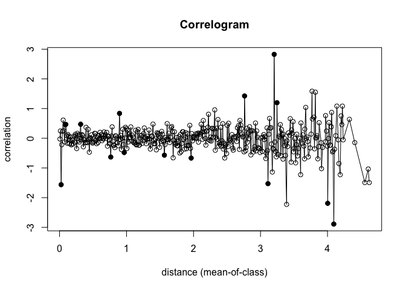
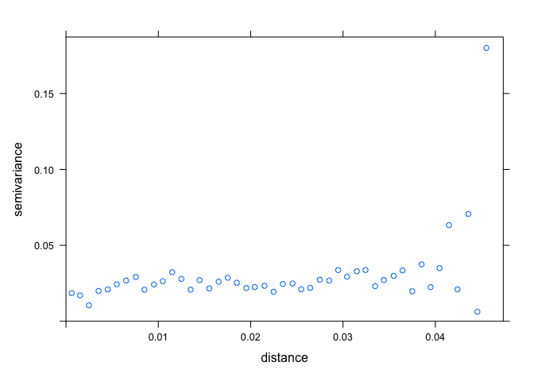

Test for spatial autocorrelation
================
Eleanor Jackson
20 January, 2023

``` r
library("tidyverse")
```

    ## ── Attaching packages ─────────────────────────────────────── tidyverse 1.3.1 ──

    ## ✓ ggplot2 3.3.5      ✓ purrr   0.3.4 
    ## ✓ tibble  3.1.6      ✓ dplyr   1.0.10
    ## ✓ tidyr   1.2.0      ✓ stringr 1.4.0 
    ## ✓ readr   2.0.2      ✓ forcats 0.5.1

    ## ── Conflicts ────────────────────────────────────────── tidyverse_conflicts() ──
    ## x dplyr::filter() masks stats::filter()
    ## x dplyr::lag()    masks stats::lag()

``` r
library("sf")
```

    ## Linking to GEOS 3.8.1, GDAL 3.2.1, PROJ 7.2.1

``` r
library("ncf")
```

    ## 
    ## Attaching package: 'ncf'

    ## The following object is masked from 'package:tidyr':
    ## 
    ##     gather

``` r
library("spdep")
```

    ## Loading required package: sp

    ## Loading required package: spData

    ## To access larger datasets in this package, install the spDataLarge
    ## package with: `install.packages('spDataLarge',
    ## repos='https://nowosad.github.io/drat/', type='source')`

``` r
library("sp")
```

``` r
readRDS(here::here("data", "clean", "pod_data.rds")) %>%
  sf::st_as_sf(coords = c("lat", "lon"), crs = 4326, remove = FALSE) %>%
  rowwise() %>%
  mutate(predation_rate = n_predated / n_total) %>%
  drop_na() -> pod_data
```

## Correlogram

A correlogram shows the correlation coefficient for the series lagged
(in distance) by one delay at a time. e.g. at lag one you’re looking at
the correlation between a point and it’s nearest neighbour. At lag two
you’re looking at the correlation between a point and it’s second
nearest neighbour.

Values close to 1 indicate clustering while values close to -1 indicate
dispersion. A random arrangement would give a value that is close to 0.

``` r
# using 10 m increments
plot(ncf::correlog(x = pod_data$lat, y = pod_data$lon, z =  pod_data$predation_rate,
              latlon = TRUE, increment = 0.01))
```

    ## 100  of  999 200  of  999 300  of  999 400  of  999 500  of  999 600  of  999 700  of  999 800  of  999 900  of  999 

<!-- -->

Here, values significant at a nominal (two-sided) 5%-level are
represented by filled circles and non-significant values by open
circles.

Most of the plot shows values that are close to zero, without
significant auto correlation. There are a few points that do show
correlation but they seem quite random and there is not many of them…
outliers? I think that if there was a pattern of spatial autocorrelation
in the data we would see values that tended towards zero as distance
increased.

## Moran’s I

The expected value of Moran’s I under the null hypothesis of no spatial
autocorrelation is `-1/(n-1)`, which equals `-0.01123596` for this data.

Values significantly below `-1/(n-1)` indicate negative spatial
autocorrelation and values significantly above `-1/(n-1)` indicate
positive spatial autocorrelation.

``` r
# detect nearest neighbours within a 15 km radius (i.e. whole island)
spdep::dnearneigh(pod_data$geometry, 0, 15, 
                  row.names = pod_data$tree_id,  
                  longlat = TRUE) -> nn
```

    ## Warning in spdep::dnearneigh(pod_data$geometry, 0, 15, row.names =
    ## pod_data$tree_id, : dnearneigh: longlat argument overrides object

``` r
# add spatial weights
lw <- spdep::nb2listw(nn, style = "W", zero.policy = TRUE) 

# Moran's test for spatial autocorrelation
spdep::moran.test(pod_data$predation_rate, lw) 
```

    ## 
    ##  Moran I test under randomisation
    ## 
    ## data:  pod_data$predation_rate  
    ## weights: lw    
    ## 
    ## Moran I statistic standard deviate = -4.6509e-10, p-value = 0.5
    ## alternative hypothesis: greater
    ## sample estimates:
    ## Moran I statistic       Expectation          Variance 
    ##     -1.123596e-02     -1.123596e-02      5.564668e-17

There is very little difference between the expected and observed
Moran’s I, and the test is non significant, meaning we can accept the
null hypothesis of no spatial autocorrelation.

## Variogram

A variogram describes the variance of the difference between values at
two locations.

Here, the x axis represents the distance between traps (km) and each
point represents a pair of observations. The distance at which the
variogram stops increasing and flattens out is the range. Traps which
are closer together than this distance are spatially autocorrelated.

``` r
sp::coordinates(pod_data) = ~lat+lon

plot(
    gstat::variogram(predation_rate ~ 1, data = pod_data, 
        width = 0.001, cutoff = 15000) 
)
```

<!-- -->

Looks to me like we don’t have any spatial autocorrelation - we
immediately reach the ‘sill’ where the semivariance is flat.
