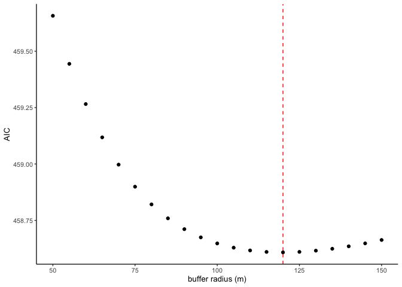

Choose an alpha value
================
Eleanor Jackson
23 January, 2023

To determine the buffer radius to use for our connectivity calculation
we will fit models with varying values of *r* and compare their AIC
values. *r* is the average migration distance of our seed predator and
*r* = 1 / $\alpha$

**Connectivity**  

$$C_{i} = \sum_{j \neq i} exp( -\ \alpha \ dist_{ji} ) A_{j}$$

``` r
library("tidyverse")
```

    ## ── Attaching packages ─────────────────────────────────────── tidyverse 1.3.1 ──

    ## ✔ ggplot2 3.4.1     ✔ purrr   0.3.4
    ## ✔ tibble  3.1.8     ✔ dplyr   1.1.0
    ## ✔ tidyr   1.2.0     ✔ stringr 1.5.0
    ## ✔ readr   2.0.2     ✔ forcats 0.5.1

    ## ── Conflicts ────────────────────────────────────────── tidyverse_conflicts() ──
    ## ✖ dplyr::filter() masks stats::filter()
    ## ✖ dplyr::lag()    masks stats::lag()

``` r
library("geosphere")
library("sf")
```

    ## Linking to GEOS 3.8.1, GDAL 3.2.1, PROJ 7.2.1

## Get data

``` r
readRDS(here::here("data", "clean", "pod_data.rds")) %>% 
  mutate(crown_area_m2 = pi * crown_radius_m^2) %>% 
  select(tree_id, lon, lat, crown_area_m2) -> focal_jacc

st_read(here::here(
  "data", "maps",
  "jacc-map-garzonlopez2012", "JAC1COpointSept.shp"
)) %>% 
  filter(!st_is_empty(.)) %>%
  select(geometry) -> point_data
```

    ## Reading layer `JAC1COpointSept' from data source 
    ##   `/Users/eleanorjackson/Library/CloudStorage/OneDrive-UniversityofReading/bci-jacc/data/maps/jacc-map-garzonlopez2012/JAC1COpointSept.shp' 
    ##   using driver `ESRI Shapefile'
    ## Simple feature collection with 977 features and 26 fields
    ## Geometry type: POINT
    ## Dimension:     XY
    ## Bounding box:  xmin: 624357.3 ymin: 1009741 xmax: 629582.1 ymax: 1014470
    ## Projected CRS: NAD27 / UTM zone 17N

``` r
st_read(here::here(
  "data", "maps",
  "polygons-garzonlopez2008", "JAC1CO_pol2008.shp"
)) %>% 
  filter(!st_is_empty(.)) %>%
  select(geometry) -> polygon_data
```

    ## Reading layer `JAC1CO_pol2008' from data source 
    ##   `/Users/eleanorjackson/Library/CloudStorage/OneDrive-UniversityofReading/bci-jacc/data/maps/polygons-garzonlopez2008/JAC1CO_pol2008.shp' 
    ##   using driver `ESRI Shapefile'
    ## replacing null geometries with empty geometries
    ## Simple feature collection with 990 features and 5 fields (with 4 geometries empty)
    ## Geometry type: POLYGON
    ## Dimension:     XY
    ## Bounding box:  xmin: 624350.9 ymin: 1009737 xmax: 629584.4 ymax: 1014483
    ## Projected CRS: NAD27 / UTM zone 17N

Filter Carol’s mapped trees to only include trees that have polygon data
and use the polygons to calculate crown area (m^2)

``` r
st_join(polygon_data, point_data, 
        join = st_within, largest = TRUE, left = FALSE) %>%  
  mutate(crown_area_m2 = as.numeric(st_area(geometry))) %>% 
  mutate(tree_id = paste0("CGL_", 1:n()),
         geometry = st_centroid(geometry)) %>% 
  sf::st_transform(crs = "+proj=longlat +datum=WGS84", allow_ballpark = FALSE) %>% 
  mutate(lon = sf::st_coordinates(.)[,1],
         lat = sf::st_coordinates(.)[,2]) -> other_jacc
```

    ## Warning: attribute variables are assumed to be spatially constant throughout
    ## all geometries

We only want to include reproductive individuals. The minimum
reproductive size of *J. copaia* is 20 cm dbh [(Wright et
al. 2005)](https://doi.org/10.1017/S0266467405002294).

We can use Helene’s allometry data to estimate dbh from crown area (see
[`2022-10-11_estimate-crown.md`](2022-10-11_estimate-crown.md)).

DBH = (crown area + 99.42) / 0.38

``` r
other_jacc %>%
  mutate(dbh_estimate_mm = (crown_area_m2 + 99.42) / 0.38) %>%
  filter(dbh_estimate_mm >= 200) %>% 
  select(- dbh_estimate_mm) -> other_jacc
```

Oh.. there aren’t any trees in the data with a dbh less than 20 cm. I
guess maybe they’re too small to pick up in aerial photographs.

## Remove duplicated trees

Trees mapped in our ‘on the ground’ data could be the same individuals
as those in Carol’s aerial maps.

``` r
geosphere::distm(cbind(pull(focal_jacc, lon), pull(focal_jacc, lat)),
  cbind(pull(other_jacc, lon), pull(other_jacc, lat)),
  fun = distGeo
) -> dist_matrix

rownames(dist_matrix) <- focal_jacc$tree_id
colnames(dist_matrix) <- other_jacc$tree_id

# assume closest CGL tree within 20 m of focal tree is the same tree
as.data.frame.table(dist_matrix, responseName = "dist") %>%
  filter(dist <= 20) %>% 
  group_by(Var1) %>%
  slice(which.min(dist)) %>% 
  ungroup() -> duplicate_trees
  
other_jacc %>%
  filter(!tree_id %in% pull(duplicate_trees, Var2)) -> other_jacc_no_dupes

other_jacc_no_dupes %>% 
  st_drop_geometry() %>% 
  bind_rows(focal_jacc) -> all_jacc

# if focal tree was duplicated in CGL data, use polygon for crown area not radius
duplicate_trees %>%
  left_join(other_jacc, by = c("Var2" = "tree_id")) %>% 
  select(Var1, crown_area_m2) %>% 
  rename(tree_id = Var1) %>%
  right_join(y = all_jacc, by = "tree_id", 
             suffix = c("_poly", "_radius")) %>% 
  mutate(crown_area_m2 = ifelse(is.na(crown_area_m2_poly), 
                                crown_area_m2_radius, crown_area_m2_poly)) %>%
  select(- crown_area_m2_poly, -crown_area_m2_radius) -> all_jacc_areas
```

## Calculate pairwise distances between trees

``` r
calculate_dist <- function (data) {
  
  data %>%
    select(lon, lat) -> plot_matrix
  
  geosphere::distm(plot_matrix, 
               fun = distGeo) -> dists
  
  as.data.frame(dists) -> dists_df
  
  unlist(data$tree_id) -> colnames(dists_df) 
  
  cbind(data, dists_df)
  
}

distance_df <- calculate_dist(all_jacc_areas)
```

## Calculate connectivity using a range of radii

``` r
focal_jacc %>%
  distinct(tree_id) %>%
  pull(tree_id) -> focal_tree_id_list

tibble(radii = seq(25, 125, 5)) -> radii_list

lapply(radii_list, function(x) 1 / x ) -> alpha_list

merge(focal_tree_id_list, alpha_list) %>%
  rename(id = x, alpha = radii) -> alpha_tree_id

calculate_connectivity <- function (data, id, alpha) {
  data %>%
    filter(tree_id != eval(parse(text = id))) %>%
    select(id, crown_area_m2) %>%
    mutate(x = exp(- alpha * eval(parse(text = id)) ) * crown_area_m2) %>%
    summarise(connectivity = sum(x),
              tree_id = paste(id),
              alpha = eval(parse(text = paste0(alpha))))
}

connectivity_dfs <- pmap(alpha_tree_id, .f = calculate_connectivity, 
                         data = distance_df)
```

    ## Warning: Using an external vector in selections was deprecated in tidyselect 1.1.0.
    ## ℹ Please use `all_of()` or `any_of()` instead.
    ##   # Was:
    ##   data %>% select(id)
    ## 
    ##   # Now:
    ##   data %>% select(all_of(id))
    ## 
    ## See <https://tidyselect.r-lib.org/reference/faq-external-vector.html>.

``` r
connectivity_dfs %>%
  dplyr::bind_rows() -> all_connectivity_dfs

readRDS(here::here("data", "clean", "pod_data.rds")) %>% 
  drop_na() %>% 
  mutate_at(c("n_total", "n_predated"), round) %>% 
  left_join(all_connectivity_dfs, by = "tree_id",
            multiple = "all") %>% 
  group_by(alpha) %>%
  nest() %>%
  ungroup() %>%
  pull(data) -> connectivity_dfs_alpha
```

## Fit models and look at AIC

``` r
fit_glmms <- function (data) {
  lme4::glmer(
    data,
    formula = cbind(n_predated, (n_total - n_predated)) ~ 
      connectivity_sc + (1 | dbh_mm),
    family = "binomial"
  )
  
}

model_data <- map(connectivity_dfs_alpha, ~ data.frame(.) %>%
                    mutate(connectivity_sc = scale(connectivity)) )

models <- lapply(model_data, fit_glmms)

lapply(models, AIC) -> AIC_list

tibble(radius = unlist(radii_list), AIC = unlist(AIC_list)) -> AIC_df

AIC_df %>%
  ggplot(aes(x = radius, y = AIC)) + geom_point()
```

<!-- -->

A radius of **85** has the lowest AIC.

I just want to check that we’re not missing something by not looking at
bigger radii. We don’t know how far our seed predator or pollinators
travel and a big part of this study was to look for J-C effects at
larger scales.

``` r
tibble(radii = seq(100, 15000, 500)) -> radii_list

lapply(radii_list, function(x) 1 / x ) -> alpha_list

merge(focal_tree_id_list, alpha_list) %>%
  rename(id = x, alpha = radii) -> alpha_tree_id

connectivity_dfs <- pmap(alpha_tree_id, .f = calculate_connectivity, 
                         data = distance_df)

connectivity_dfs %>%
  dplyr::bind_rows() -> all_connectivity_dfs

readRDS(here::here("data", "clean", "pod_data.rds")) %>% 
  drop_na() %>% 
  mutate_at(c("n_total", "n_predated"), round) %>%
  left_join(all_connectivity_dfs, by = "tree_id",
            multiple = "all") %>% 
  group_by(alpha) %>%
  nest() %>%
  ungroup() %>%
  pull(data) -> connectivity_dfs_alpha

model_data <- map(connectivity_dfs_alpha, ~ data.frame(.) %>%
                    mutate(connectivity_sc = scale(connectivity)))

models <- lapply(model_data, fit_glmms)

lapply(models, AIC) -> AIC_list

tibble(radius = unlist(radii_list), AIC = unlist(AIC_list)) %>%
  ggplot(aes(x = radius, y = AIC)) + geom_point()
```

<!-- -->

OK nope!
