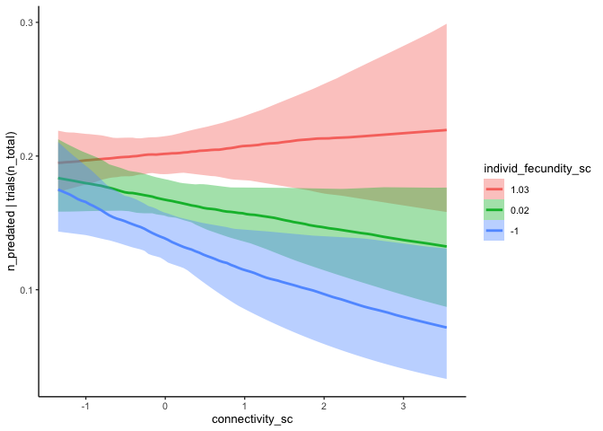
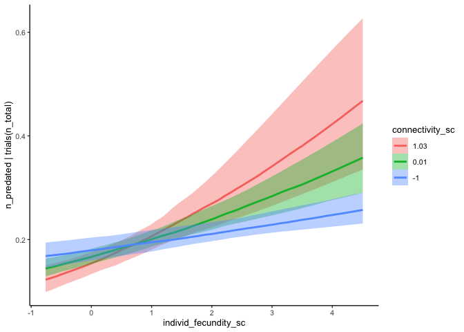
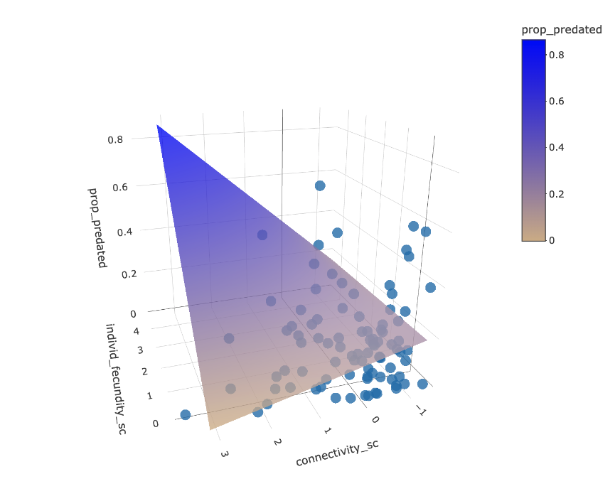

Explore interaction effect
================
eleanorjackson
27 February, 2023

We found that the interaction between individual tree fecundity and
connectivity had a likely positive effect on the rate of predispersal
seed predation.

> An important concept of models with multiple predictors is
> interaction. Interaction means that the effect of a predictor depends
> on the level of another predictor. A little more technically,
> interaction is what is left over after the main effects of the factors
> are added: interaction is the nonadditive influence of the factors.

from Doing Baysian Analysis by John Kruschke p.585

> I want to convince the reader that interaction effects are difficult
> to interpret. They are nearly impossible to interpret, using only
> posterior means and standard deviations. Once interactions exist,
> multiple parameters are in play at the same time.

from Statistical Rethinking by Richard McElreath p.252

Not very encouraging.. Let’s explore.

``` r
library("tidyverse")
library("here")
library("plotly")
library("reshape2")
library("brms")
```

``` r
readRDS(here::here("data", "clean", "connect_pod_data.rds"))  %>% 
  mutate(
    connectivity_sc = as.numeric(scale(connectivity)),
    individ_fecundity_sc = as.numeric(scale(individ_fecundity))
  ) %>%
  mutate(prop_predated = n_predated / n_total) %>%
  drop_na() -> model_data

model_fit <- readRDS(here::here("output", "models", "model_fit.rds"))
```

``` r
plot(conditional_effects(model_fit,
                         effects = "connectivity_sc:individ_fecundity_sc", 
                         ndraws = 150, robust = TRUE))
```

    ## Setting all 'trials' variables to 1 by default if not specified otherwise.

<!-- -->

``` r
plot(conditional_effects(model_fit,
                         effects = "individ_fecundity_sc:connectivity_sc", 
                         ndraws = 150, robust = TRUE))
```

    ## Setting all 'trials' variables to 1 by default if not specified otherwise.

<!-- -->

In these plots the second predictor is depicted as three lines
corresponding to its mean and its mean +/- one standard deviation.

The model believes that the effect of fecundity increases as
connectivity increases.

Let’s try one of those weird 3D plots.

This code is adapted from
[here](https://stackoverflow.com/questions/50573936/r-how-to-change-color-of-plotly-3d-surface).

``` r
# using Gaussian because it's just easier for predicting
freq_mod <- glm(
  formula = prop_predated
  ~ connectivity_sc * individ_fecundity_sc,
  data = model_data
)

graph_reso <- 0.5
axis_x <- seq(min(model_data$individ_fecundity_sc), 
              max(model_data$individ_fecundity_sc), by = graph_reso)
axis_y <- seq(min(model_data$connectivity_sc), 
              max(model_data$connectivity_sc), by = graph_reso)

surface <- expand.grid(
  individ_fecundity_sc = axis_x,
  connectivity_sc = axis_y,
  KEEP.OUT.ATTRS = F
)

surface$prop_predated <- predict(freq_mod, newdata = surface)

surface_plot <- acast(surface, connectivity_sc ~ 
                        individ_fecundity_sc, value.var = "prop_predated")

p <- plot_ly(data = model_data) %>%
  add_trace(
    x = ~individ_fecundity_sc, y = ~connectivity_sc, z = ~prop_predated,
    type = "scatter3d", mode = "markers",
    opacity = .8
  ) %>% 
  add_trace(
    z = surface_plot,
    x = axis_x,
    y = axis_y,
    opacity = .8,
    type = "surface", colorscale = list(c(0, 1), c("tan", "blue"))
  )
```



This is nice to play with interactively, but don’t think it’ll work so
well as a flat plot.
