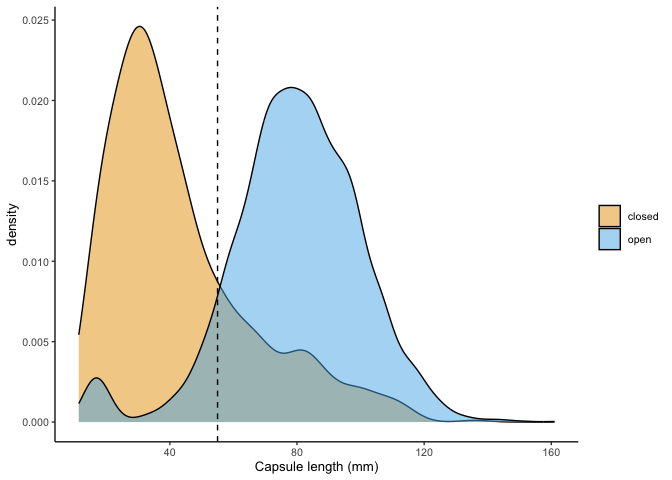

Explore capsule sizes
================
eleanorjackson
03 March, 2023

When collecting data in the field we didn’t classify capsules as
immature or mature, but instead recorded their size and whether they
were open or not.

From this information we should be able to classify pods as immature or
mature. Immature pods do not dehisce in the canopy but might have opened
on the forest floor.

``` r
library("tidyverse")
library("here")
```

``` r
read.csv(here::here("data", "raw", "jacaranda_pods.csv"),
         header = TRUE, na.strings = c("", "NA", "missing")) %>%
  filter(tree != "JACC_130") %>%
  mutate(fragment = case_when(str_detect(comments, "fragment") ~ TRUE,
                              TRUE ~ FALSE)) %>%  
  mutate(pod_half_whole = recode(pod_half_whole, "half" = 0.5,
                                 "whole" = 1)) %>%
  mutate(pod_size_mm = coalesce(pod_size_string_mm, pod_size_mm)) %>%
  mutate(pod_size_mm = as.numeric(pod_size_mm)) %>% 
  filter(fragment == FALSE) %>% 
  mutate(pod_healthy = case_when(
    str_detect(morph, "^symmetrical_locules") ~ TRUE,
    is.na(morph) ~ NA,
    TRUE ~ FALSE
  )) -> pod_data

pod_data %>% 
  filter(pod_half_whole == 1) %>% 
  bind_rows() -> pod_halves

healthy_halves <- filter(pod_halves, pod_healthy == TRUE)
```

``` r
filter(pod_data, pod_healthy == TRUE) %>%
  drop_na(pod_size_mm) %>% 
  ggplot(aes(x = pod_size_mm, fill = pod_open_closed)) +
  geom_density(alpha = 0.5) +
  scale_fill_manual(values = c("#E69F00", "#56B4E9")) +
  xlab("Capsule length (mm)") +
  theme(legend.title = element_blank()) +
  geom_vline(xintercept = 55, linetype = 2) 
```

<!-- -->

There’s a small number of pods that are open but are comparatively small
(the first blue hump). These are probably immature capsules that opened
on the forest floor.

I think we can take the median value between the two peaks (55mm) to
separate the pods into mature and immature.

Let’s take a quick look at capsule sizes between the different
categories: mature, immature and predated.

``` r
pod_halves %>%
  mutate(pod_category = case_when(
    pod_size_mm < 55 & str_detect(morph, "^symmetrical_locules") ~ "immature",
    morph == "asymmetrical_locules" |
      morph == "single_locule" |
      morph == "small_knobbly" ~ "predated",
    is.na(morph) ~ NA,
    TRUE ~ "mature"
  )) %>% 
  filter(!is.na(pod_category)) -> pod_groups

pod_groups %>% 
  ggplot(aes(x = pod_size_mm, fill = pod_category)) +
  geom_density(alpha = 0.6) +
  xlab("Capsule length (mm)") +
  theme(legend.title = element_blank()) +
  scale_fill_manual(values = c("#E69F00", "#56B4E9", "#009E73")) 
```

<!-- -->

Let’s pull some numbers out for the manuscript.

``` r
pod_groups %>% 
  group_by(pod_category) %>% 
  summarise(median = median(pod_size_mm), mean = mean(pod_size_mm))
```

    ## # A tibble: 3 × 3
    ##   pod_category median  mean
    ##   <chr>         <dbl> <dbl>
    ## 1 immature       31.8  32.6
    ## 2 mature         83.2  84.7
    ## 3 predated       25.9  28.5
